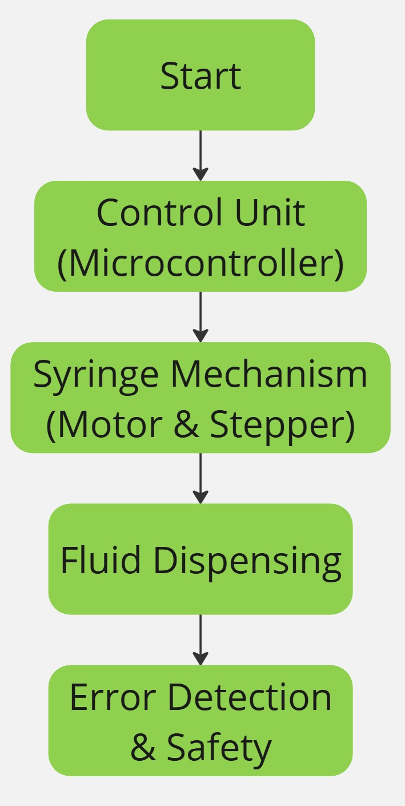

# Syringe Pump Design Project

## Group Members
1. Nguyễn Quốc Trung Nhân (BEBEIU22184)
2. Âu Đào Đoan Trúc (BEBEIU22156)
3. Kim Phương Thùy (BEBEIU22283)
4. Phạm Hoàng Anh Thư (BEBEIU22276)

## Introduction
Our project focuses on designing a **syringe pump** for medical applications. The device is intended to deliver precise volumes of fluids at controlled rates, crucial in treatments such as IV therapy and medication infusion. Key features include:
- **Adjustable flow rates** for various medical needs.
- **User-friendly interface** for medical professionals.
- **Compact design** for portability.

## Flow Chart
The operational workflow of the syringe pump is depicted below:

## Block Diagram
The system's core components and interactions are outlined here:
.

## State Diagram
The various operational states of the syringe pump are illustrated as follows:

## Repository
This repository contains:
- **Design documentation**
- **Code for system control**
- **CAD files for the syringe pump design**

---
